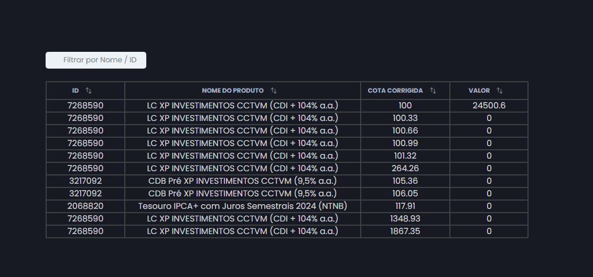

# Projeto 4RH

Este foi um projeto desenvolvido a partir do teste tecnico da 4RH.

Consiste em ser uma tabela que lista os dados de uma API Rest e nos permite fazer algumas funções (tal como filtrar a tabela pelo nome / id, e ordenar os valores ao clicar no botão ao lado do nome da coluna):

## Gif de exemplo

## Tecnologias

<ul>
  <li>TypeScript</li>
  <li>React</li>
</ul>

### Melhorias futuras

<ul>
  <li>Tornar a tabela responsiva para dispositivos móveis</li>
</ul>
